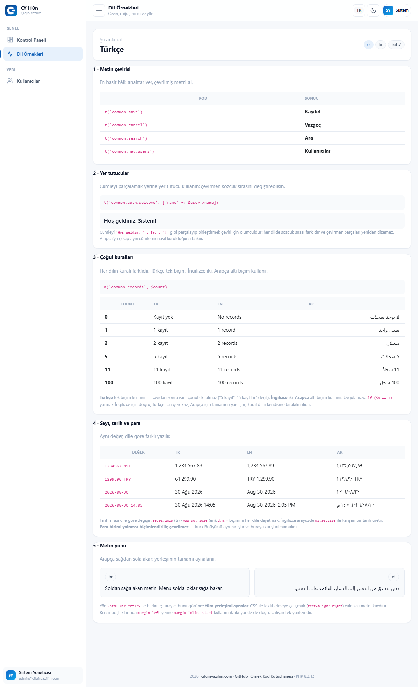
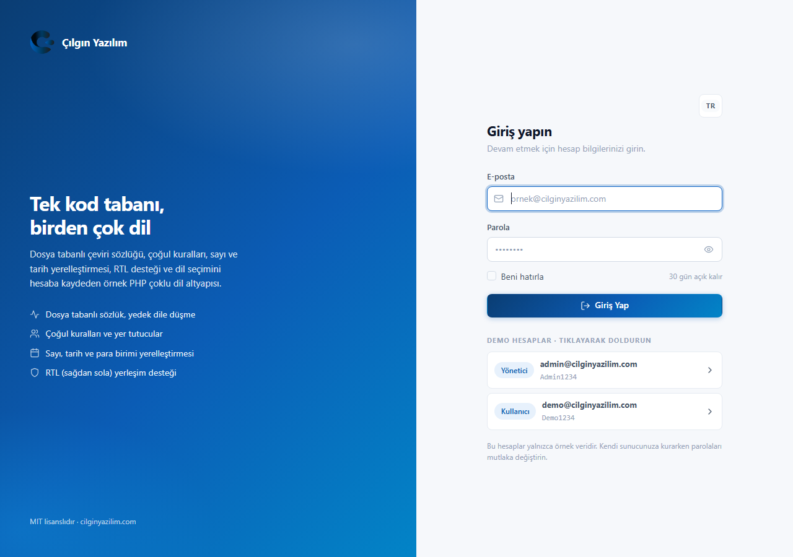
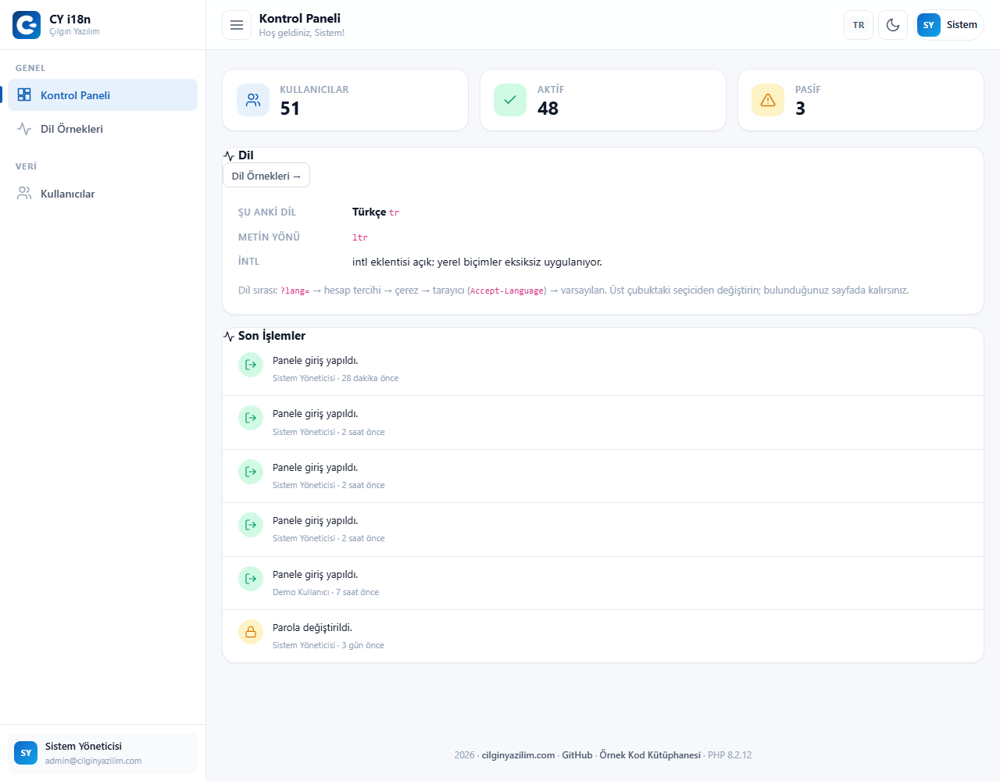
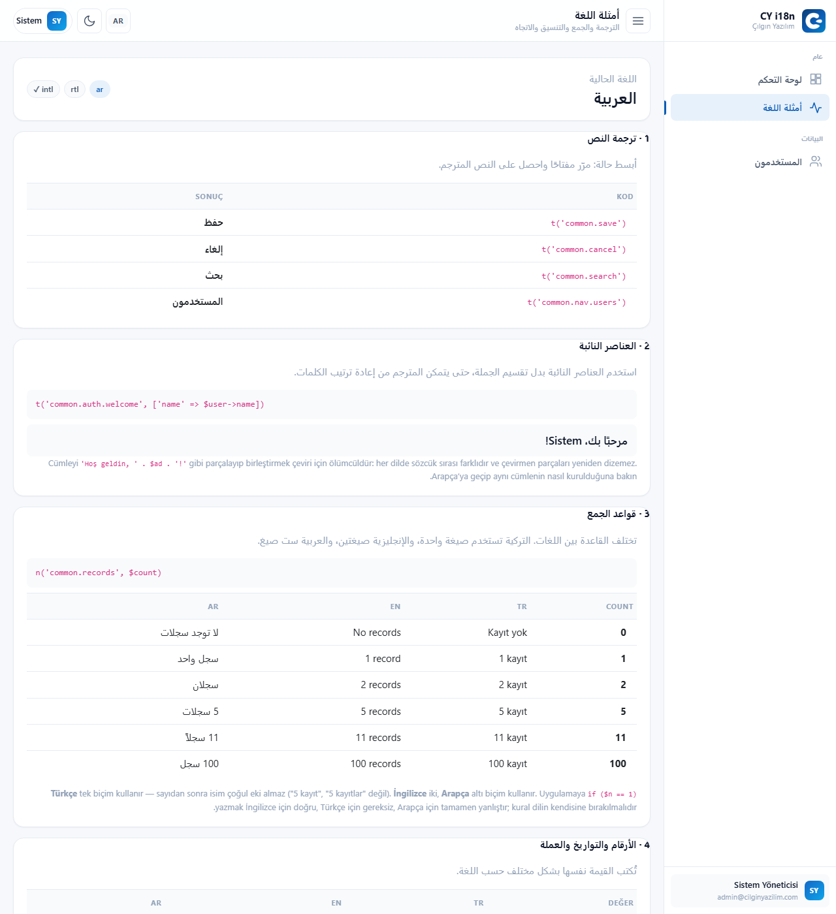
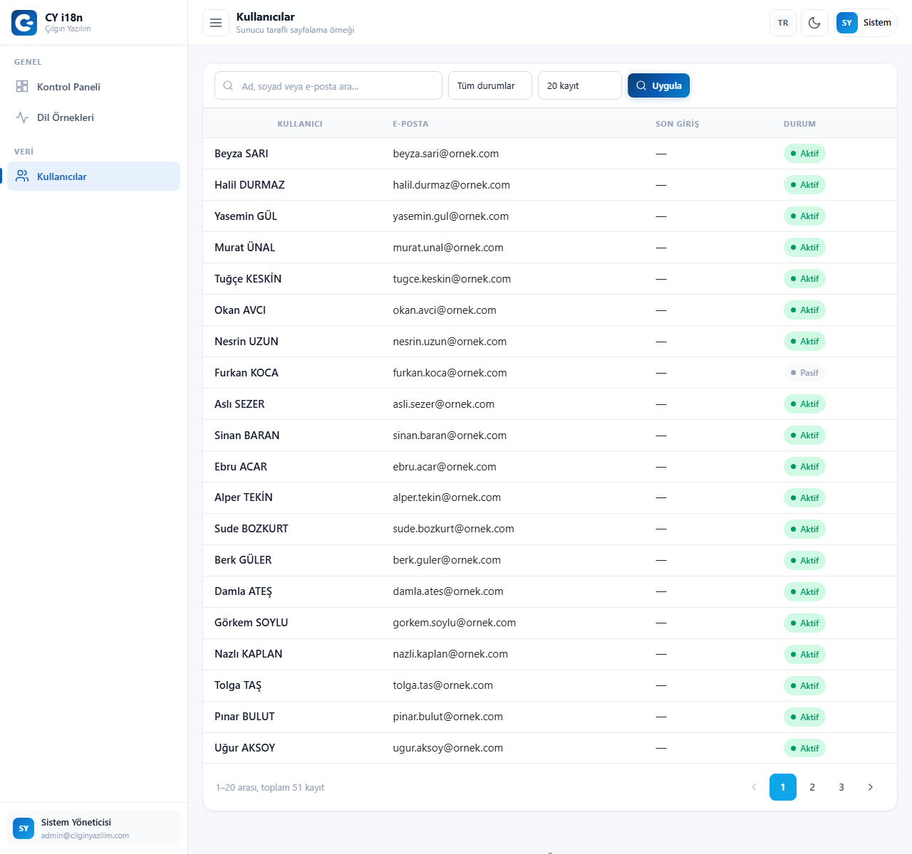
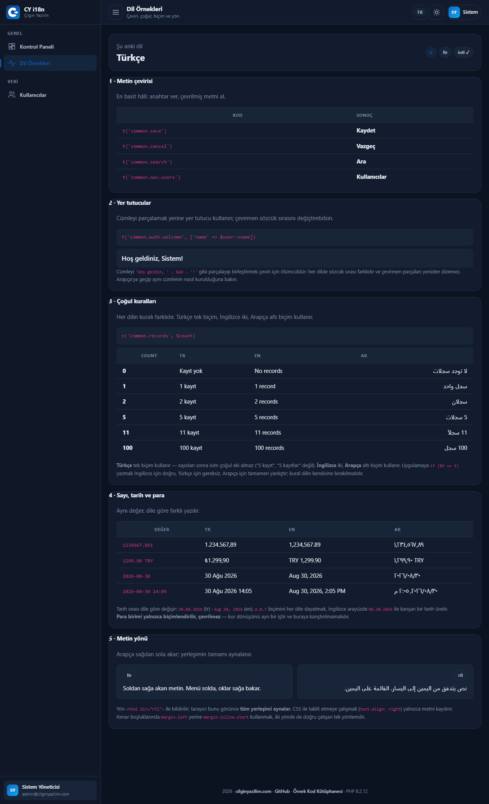
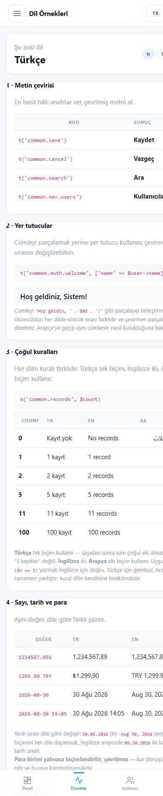

<div align="center">


# Multi-Language (i18n) System

### PHP 8 · PDO · MySQL · Session-Based Admin Panel · Plural Rules · RTL · Çılgın Yazılım Design Pattern

**Three languages, three different plural rule sets, and a right-to-left interface — no libraries.**

[](https://php.net)
[](https://mysql.com)
[](https://getbootstrap.com)
[](#installation)
[](LICENSE)

[🇹🇷 Türkçe](README.md) · **🇬🇧 English**

[**▶ Live Demo**](https://cilginyazilim.com/kutuphane/uygulama/PHP-MySQL-Coklu-Dil-i18n-Cogul-Kurallari-RTL-Panel-main/) · [Code Library](https://cilginyazilim.com/kutuphane/php-multi-language-i18n) · [cilginyazilim.com](https://cilginyazilim.com)

</div>

---

<div align="center">

## Live Demo

**No setup, no sign-up, no download — try it in your browser in 3 seconds.**

<a href="https://cilginyazilim.com/kutuphane/uygulama/PHP-MySQL-Coklu-Dil-i18n-Cogul-Kurallari-RTL-Panel-main/"></a>
<a href="https://cilginyazilim.com/kutuphane/php-multi-language-i18n"></a>
<a href="https://github.com/CilginYazilim/PHP-MySQL-Coklu-Dil-i18n-Cogul-Kurallari-RTL-Panel/archive/refs/heads/main.zip"></a>

<br><br>

<a href="https://cilginyazilim.com/kutuphane/uygulama/PHP-MySQL-Coklu-Dil-i18n-Cogul-Kurallari-RTL-Panel-main/" title="Click to open the live demo">
  
</a>

<sub>▲ Click the image to open the demo</sub>

</div>

<br>

### Demo accounts

| Role | E-mail | Password |
|---|---|---|
| Administrator | `admin@cilginyazilim.com` | `Admin1234` |
| User | `demo@cilginyazilim.com` | `Demo1234` |

The login screen has one-click buttons that fill these in for you.

### What can you try in 60 seconds?

| # | Try this | What happens behind the scenes |
|---|---|---|
| **1** | Pick `EN` from the **language switcher** in the top bar | The page reloads but **you stay on the same page**. The switcher does not throw you back to the home page; it appends `?lang=` to your current URL |
| **2** | Now pick `AR` | The whole layout **mirrors**: the sidebar moves right, text aligns right, table columns reverse. There is no separate "RTL stylesheet" — the CSS uses logical properties, so `dir="rtl"` is enough |
| **3** | On the **Language Examples** page, look at the "Plural rules" table | The numbers `0, 1, 2, 5, 11, 100` show **different** forms across three languages. Turkish uses one form, English two, Arabic **six** |
| **4** | In the same table, look at row `2` in the Arabic column | It says `سجلان` — neither singular nor plural, but Arabic's **dual** form. Code written as `if ($n == 1)` can never produce this |
| **5** | Read the "Placeholders" sentence in Arabic | `Welcome, System!` is built with a **different word order** in Arabic. Splitting the sentence into `'Welcome, ' . $name` would make that impossible |
| **6** | Look at the "Numbers, dates and currency" table | The same value is written three different ways: thousand separator, decimal separator, and the position of the currency symbol all change. This is `intl`, not `number_format()` |
| **7** | Log out, pick `AR`, then **log in** | Your language choice **carries over** from the login screen into the panel and is saved to your account. Clearing cookies won't lose it |
| **8** | Click the **moon/sun** icon at the top right | Dark theme turns on and is saved to your account. Table cell contrast is measured in dark mode too (14.5:1) |
| **9** | Type `ş` into the search box on the **Users** page | Search runs server-side; `LIKE` wildcards are escaped and the sort column is validated against a **whitelist** |
| **10** | Open it on your phone | The sidebar becomes bottom navigation; there is **no horizontal scrolling** on the page body |

> **Tip:** While the demo is open, append `?lang=ar` to the address bar. See [How is the language chosen?](#how-is-the-language-chosen) — the order is `?lang=` → account → cookie → browser → default.

### What to know about the demo area

| Topic | Status |
|---|---|
| **Data** | The **51 sample users** in `database.sql`. No real personal data; addresses end in `@ornek.com`. |
| **Reset** | The demo database is **periodically restored** to its initial state; your changes are not permanent. |
| **Authentication** | **Yes.** Sessions, "remember me" tokens, rate limiting and CSRF protection are all included. |
| **`APP_DEBUG`** | Automatically **`false`** in production — derived from the host name, stays `true` locally. |
| **`intl` extension** | **Enabled** on the demo server. Without it the app keeps working, only the locale-aware formats become simpler. |
| **Dependencies** | **Zero.** No Composer, no npm, no CDN. The demo works identically on an offline server. |

> If the demo is temporarily down, don't worry: cloning the repo and importing `database.sql` gets the same screen running on your machine in **2 minutes** → [Installation](#installation)

---

## What Is This Project?

"Let's make the site multilingual" usually starts by creating an array file with `$lang['save'] = 'Save';` and ends right there. Then the first real sentence arrives — *"5 records found"* — and the system falls apart. Because:

- **In Turkish** no plural suffix follows a number: "5 kayıt", never "5 kayıtlar".
- **In English** there are two forms: "1 record" / "5 records".
- **In Arabic there are six** forms, and one of them is the **dual**: for 2, a completely different word is used — neither singular nor plural.

Code written as `if ($n == 1)` is correct for English, unnecessary for Turkish and **entirely wrong** for Arabic. The rule belongs to the language, not to your code.

This project builds an i18n layer that leaves that rule to the language itself: translations live as PHP arrays under `lang/<locale>/`, the plural form is selected by **`intl`'s `MessageFormatter`**, numbers/dates/currency are localised with **`NumberFormatter` and `IntlDateFormatter`**, and the interface flips to right-to-left **without a single extra CSS file** when you switch to Arabic.

Better still, all of this runs **inside a real, session-authenticated admin panel**: the user's language preference is stored on their account and travels between devices alongside their theme preference.

**Who is it for?**

- Anyone about to add a second (or third) language to their project
- Anyone who wants to learn that the answer to "how do I pluralise?" is not `if`
- Anyone shipping Arabic, Persian or Hebrew support (RTL)
- Anyone who wants to get the job done with PHP's own `intl` extension instead of a library
- Anyone looking for a reusable admin panel pattern built on Bootstrap 5

> **Clone, import `database.sql`, run.** There are no other setup steps. No Composer, no npm — not even an internet connection: every library ships inside the project.

This project is one of the documented, production-ready examples published in the **[Çılgın Yazılım Code Library](https://cilginyazilim.com/kutuphane)**.

---

## Table of Contents

- [Live Demo](#live-demo)
- [What Is This Project?](#what-is-this-project)
- [Screenshots](#screenshots)
- [Key Decisions](#key-decisions)
- [What's Included?](#whats-included)
- [Translation is four jobs](#translation-is-four-jobs)
- [Plural rules](#plural-rules)
- [How is the language chosen?](#how-is-the-language-chosen)
- [RTL support](#rtl-support)
- [Adding a new language](#adding-a-new-language)
- [Security: What Did We Close, and How?](#security-what-did-we-close-and-how)
- [Installation](#installation)
- [Configuration](#configuration)
- [Adding It to Your Own Project](#adding-it-to-your-own-project)
- [File Structure](#file-structure)
- [How Does It Work?](#how-does-it-work)
- [Database Schema](#database-schema)
- [FAQ](#faq)
- [Going to Production](#going-to-production)
- [Troubleshooting](#troubleshooting)
- [Roadmap](#roadmap)
- [Contributing](#contributing)
- [License](#license)

---

## Screenshots

| Login | Dashboard |
|---|---|
|  |  |

| Language Examples | Arabic (RTL) |
|---|---|
|  |  |

| Users | Dark Theme |
|---|---|
|  |  |

<div align="center">

<br><sub>Mobile view at 390px — no horizontal scrolling</sub>
</div>

---

## Key Decisions

This section answers "why was it done this way?" Every item is a deliberate decision.

### 1. `intl` decides the plural rule, not `if`

The wrong way:

```php
$text = $n == 1 ? '1 record' : "$n records";
```

This imposes English grammar on every language. The right way is to ask the language:

```php
echo n('common.records', $count);
```

Behind the scenes `MessageFormatter` runs and uses the ICU pattern from the translation file:

```php
// lang/ar/common.php
'records' => '{n, plural, zero{لا توجد سجلات} one{سجل واحد} two{سجلان} few{# سجلات} many{# سجلاً} other{# سجل}}',
```

Arabic's six categories (`zero`, `one`, `two`, `few`, `many`, `other`) appear right there. The Turkish file only has `other` — because that is what Turkish needs. **The code knows no language's rules.**

### 2. Don't split sentences; use placeholders

The wrong way:

```php
echo t('welcome_prefix') . ' ' . $user->name . '!';
```

This assumes word order is the same in every language. In Arabic it isn't. The right way:

```php
echo t('common.auth.welcome', ['name' => $user->name]);
```

The translator now sees the whole sentence and builds it according to their own language's order. The placeholder works wherever it lands.

### 3. Language comes from five sources, in a specific order

`Translator::resolve()` follows this order:

```
?lang=  →  account preference  →  cookie  →  browser (Accept-Language)  →  default
```

The order is not arbitrary: the outermost source is an **explicit** request (the URL), the innermost is a **guess** (the browser). The URL beats everything else, because the user asked for it deliberately, right now.

The incoming value passes a **whitelist** at every step via `Translator::supports()`; a locale code not defined in `Translator::LOCALES` is never accepted. Otherwise `?lang=../../etc/passwd` would become a file path.

### 4. The language preference lives in both the cookie and the account

Cookie only, and the user loses their choice when they move from work to home or clear their cookies. Account only, and a **logged-out** visitor could never pick a language.

Both: visitors carry it in a cookie, members carry it on their account. At login, the cookie choice is written to the account.

### 5. Changing the language keeps you on the same page

In most examples the language switcher throws you back to the home page. That means losing your place if you were reading page 8 of a list.

Here the switcher appends `?lang=` to **your current URL**. Other query parameters (`page`, `q`, `per`) are preserved.

### 6. No separate stylesheet for RTL

Instead of `left`/`right`, the CSS uses **logical properties**:

```css
/* Wrong: goes to the opposite side in Arabic */
.cy-card { padding-left: 1rem; border-left: 3px solid; }

/* Right: follows the writing direction */
.cy-card { padding-inline-start: 1rem; border-inline-start: 3px solid; }
```

The moment `<html dir="rtl">` is written, the layout mirrors itself. There is no `rtl.css` doubling your maintenance burden.

### 7. The app doesn't crash without `intl`

The `intl` extension is not enabled by default in PHP. If it's missing, `MessageFormatter` cannot be found and the app would die.

Instead, `Translator` checks for the extension on every localisation call and falls back gracefully: the `other` form for plurals, `number_format()` for numbers, `date()` for dates. The site **keeps working**; only the formats become simpler. The "INTL" row on the dashboard tells you which mode you're in.

---

## What's Included?

<table>
<tr><td valign="top" width="50%">

**Translation layer**

- `t()` — translate text, with placeholders
- `te()` — translate and print HTML-escaped
- `n()` — translation that follows the plural rule
- Dot notation (`common.nav.users`)
- A missing key prints **the key itself** (not an empty string)
- Translation files are plain PHP arrays — no build step
- Three languages: **Turkish, English, Arabic** · 73 keys, complete in all three

**Localisation**

- Plural rules via `intl` (ICU)
- Numbers and currency via `NumberFormatter`
- Dates and times via `IntlDateFormatter`
- Automatic simple fallback when `intl` is missing

</td><td valign="top" width="50%">

**Panel and security**

- Session login, "remember me" tokens
- Login attempt **rate limiting** (`login_attempts`)
- CSRF protection (`hash_equals`)
- Hardened sessions: `HttpOnly`, `SameSite`, ID regeneration
- Content Security Policy (`script-src 'self'`)
- `X-Frame-Options: DENY`, `nosniff`, `Referrer-Policy`

**Interface**

- Çılgın Yazılım design pattern
- Light / dark theme, stored on the account
- Server-side pagination and search
- Bottom navigation on mobile, no horizontal scrolling
- Zero dependencies: no Composer, no npm, no CDN

</td></tr>
</table>

---

## Translation is four jobs

Multilingual support is not one job; it is four similar-looking jobs with different rules. The application handles each separately.

**1 · Text translation.** The simplest form: give a key, get the translated text.

```php
echo t('common.save');        // Kaydet / Save / حفظ
```

**2 · Placeholders.** When a variable goes inside a sentence.

```php
echo t('common.auth.welcome', ['name' => $user->name]);
```

**3 · Plurals.** When the form changes with the number. The language decides the rule:

```php
echo n('common.records', $count);
```

**4 · Formatting.** Numbers, dates and currency. The same value is written differently in every language:

```php
echo local_number(1234567.89, 2);  // 1.234.567,89  /  1,234,567.89
echo local_date($date);            // 3 Eylül 2026  /  September 3, 2026
echo local_money(199.90, 'TRY');   // ₺199,90       /  ₺199.90
```

---

## Plural rules

One table says it all. The output of `n('common.records', $count)` in three languages:

| `$count` | Turkish | English | Arabic |
|---|---|---|---|
| 0 | Kayıt yok | No records | لا توجد سجلات |
| 1 | 1 kayıt | 1 record | سجل واحد |
| 2 | 2 kayıt | 2 records | سجلان |
| 5 | 5 kayıt | 5 records | 5 سجلات |
| 11 | 11 kayıt | 11 records | 11 سجلاً |
| 100 | 100 kayıt | 100 records | 100 سجل |

Three things to notice:

1. **The Turkish column never changes** (except for 0). Turkish takes no plural suffix after a number.
2. **The Arabic row for 2** looks nothing like the others: `سجلان` is the dual form — neither singular nor plural.
3. **Arabic uses three different forms** for 5, 11 and 100 (`few`, `many`, `other`).

None of this is written in the PHP code. All three come from the ICU pattern in the translation file.

---

## How is the language chosen?

```
Request arrives
   │
   ├── 1) Is there ?lang=en?        → whitelisted? → if yes, USE IT
   │        (the user just asked explicitly)
   │
   ├── 2) Logged in?                → is users.locale set? → USE IT
   │        (preference saved on the account)
   │
   ├── 3) Is there a cy_locale cookie? → whitelisted? → USE IT
   │        (a logged-out visitor's earlier choice)
   │
   ├── 4) Accept-Language header    → matches a supported locale? → USE IT
   │        (the browser's guess)
   │
   └── 5) None of the above         → default locale (tr)
```

At every step the incoming value is compared against the keys of `Translator::LOCALES` (via `Translator::supports()`). No value outside that list is ever accepted — since the locale code becomes part of a file path, this check is part of the security model.

### Changing the language keeps you on the same page

The switcher takes the current URL and changes only the `lang` parameter:

```php
// views/partials/langswitch.php
<a href="<?= e(lang_url($code)) ?>">…</a>
```

The `lang_url()` helper takes the current address, preserves the other query parameters, and changes only `lang`. If you arrived at `?page=8&q=ahmet`, you stay on page 8 with the same search after switching.

---

## RTL support

Arabic, Persian and Hebrew are written right to left. That does not mean "align text right"; it means **the entire layout mirrors**.

`dir` is written on the `<html>` element:

```php
<html lang="<?= e($locale) ?>" dir="<?= e($direction) ?>">
```

`Translator::direction()` looks at the locale code and returns `rtl` or `ltr`. The direction is stored in the locale's entry in `Translator::LOCALES`:

```php
'ar' => ['name' => 'Arapça', 'native' => 'العربية', 'dir' => 'rtl', 'flag' => 'AR'],
```

The rest is CSS's job.

### The golden rule: use logical properties

| Physical (avoid) | Logical (use) |
|---|---|
| `margin-left` | `margin-inline-start` |
| `padding-right` | `padding-inline-end` |
| `border-left` | `border-inline-start` |
| `text-align: left` | `text-align: start` |
| `left: 0` | `inset-inline-start: 0` |

Logical properties say "start/end", not "left/right". Start is the left in LTR and the right in RTL. So **one rule is correct in both directions**.

For the unavoidable exceptions (a directional arrow icon, say) a single rule is enough:

```css
[dir="rtl"] .cy-arrow { transform: scaleX(-1); }
```

---

## Adding a new language

Three steps for the interface, one for the database.

**1 · Create the folder and copy the translations**

```bash
mkdir -p lang/de
cp lang/en/common.php lang/de/common.php
```

**2 · Translate the values.** Don't touch the keys; change only the right-hand side.

Use **that language's** categories in the plural patterns. German has two, like English:

```php
'records' => '{n, plural, zero{Keine Einträge} one{1 Eintrag} other{# Einträge}}',
```

**3 · Add the locale to the registry**

Supported languages live in the `Translator::LOCALES` array. Each entry carries the language's name, its native name, its **text direction** and the short code shown in the switcher:

```php
// app/Core/Translator.php
public const LOCALES = [
    'tr' => ['name' => 'Türkçe',   'native' => 'Türkçe',  'dir' => 'ltr', 'flag' => 'TR'],
    'en' => ['name' => 'İngilizce','native' => 'English', 'dir' => 'ltr', 'flag' => 'EN'],
    'ar' => ['name' => 'Arapça',   'native' => 'العربية', 'dir' => 'rtl', 'flag' => 'AR'],
    'de' => ['name' => 'Almanca',  'native' => 'Deutsch', 'dir' => 'ltr', 'flag' => 'DE'],
];
```

For a right-to-left language, writing `'dir' => 'rtl'` is all you need — there is no separate list. The switcher picks up the new language automatically, and the `Translator::supports()` whitelist is derived from this same array.

**4 · Widen the `users.locale` column**

Skip this and the new language will **appear but cannot be saved** to an account:

```sql
ALTER TABLE `users`
  MODIFY COLUMN `locale` ENUM('tr','en','ar','de') NOT NULL DEFAULT 'tr';
```

Why the column is an `ENUM`, and the trade-off involved, is explained in [Database Schema](#database-schema).

> **What if you leave a key out?** The app doesn't crash; **the key itself** appears on screen (`common.save`). This is deliberate: an empty string disappears silently, while a key shouts "there's a missing translation here".

---

## Security: What Did We Close, and How?

| Vulnerability | Typical broken code | In this project |
|---|---|---|
| **Path traversal (locale code)** | `require "lang/$_GET[lang]/common.php"` | The locale is validated against the `Translator::LOCALES` **whitelist**; anything else falls back to the default |
| **SQL injection** | `"... WHERE email = '$email'"` | All queries are prepared statements; `ATTR_EMULATE_PREPARES = false` |
| **Sort column injection** | `ORDER BY $_GET[sort]` | Column names come from a **whitelist**; direction is only `ASC`/`DESC` |
| **XSS** | `echo $user->name` | `e()` on the server, `te()` for translations; plus CSP `script-src 'self'` |
| **CSRF** | No hidden field | A token on every POST; compared with `hash_equals()` (timing-attack safe) |
| **Password leakage** | `md5($password)` | `password_hash()` / `password_verify()`; **automatic rehash** when the algorithm ages |
| **User enumeration** | "No such e-mail" | The **same** message and the **same** timing for a wrong e-mail and a wrong password (dummy hash verification) |
| **Brute force** | Unlimited attempts | Rate limiting per e-mail + IP via the `login_attempts` table |
| **Session hijacking** | Fixed session ID | ID regenerated at login; cookie is `HttpOnly` + `SameSite=Lax` + `Secure` over HTTPS |
| **Error leakage** | `display_errors=On` in production | `APP_DEBUG` is **derived from the environment**; it turns itself off on a real domain |
| **Clickjacking** | No header | `X-Frame-Options: DENY` |
| **Silent JSON loss on broken UTF-8** | `json_encode($v)` | `JSON_INVALID_UTF8_SUBSTITUTE` — one bad byte doesn't swallow the whole response |

---

## Installation

### Requirements

| | |
|---|---|
| PHP | 8.0 or newer |
| MySQL / MariaDB | 5.7+ / 10.3+ |
| Web server | Apache (`mod_rewrite`) or Nginx |
| PHP extensions | `pdo_mysql`, `mbstring` · **recommended:** `intl` |

`intl` is not required; without it the app falls back to simple formatting (see [Key Decisions #7](#7-the-app-doesnt-crash-without-intl)).

### Steps

**1 · Get the files**

```bash
git clone https://github.com/CilginYazilim/PHP-MySQL-Coklu-Dil-i18n-Cogul-Kurallari-RTL-Panel.git
cd PHP-MySQL-Coklu-Dil-i18n-Cogul-Kurallari-RTL-Panel
```

**2 · Import the database**

```bash
mysql -u root -p < database.sql
```

The file **creates the database itself** (`cy_i18n`), sets up the tables and loads 51 sample users.

**3 · Create your `.env`**

```bash
cp .env.example .env        # Windows: copy .env.example .env
```

Edit the database credentials inside.

**4 · Open it**

```
http://localhost/multi-language-system/
```

Log in with `admin@cilginyazilim.com` / `Admin1234`

### Enabling the `intl` extension

Remove the leading `;` from this line in `php.ini` and restart your server:

```ini
extension=intl
```

The **INTL** row on the dashboard tells you whether it's on.

---

## Configuration

All settings live in a single array in `config/config.php`; sensitive values are read from `.env`.

```env
APP_DEBUG=true          # delete this line: on locally, off in production
APP_URL=                # leave empty to auto-detect the address
APP_PRETTY_URLS=true    # false → /index.php?r=users

DB_HOST=127.0.0.1
DB_PORT=3306
DB_NAME=cy_i18n
DB_USER=root
DB_PASS=
```

> **`.env` is in `.gitignore`.** Your password never reaches the repository. If you delete the `APP_DEBUG` line entirely, the app decides from the environment: on for `localhost`, `*.test` and `*.local`, off on a real domain.

**No mod_rewrite?** Set `APP_PRETTY_URLS=false` in `.env`. The app falls back to `/index.php?r=users` with no code changes.

---

## Adding It to Your Own Project

The translation layer is three files and works independently of the panel.

**1 · Copy**

```
app/Core/Translator.php     → the translation engine
app/Support/helpers.php     → t() te() n() local_number() local_date() local_money()
lang/                       → translation files
```

**2 · Resolve the locale at the start of the request.** This must happen **before your views**; otherwise the first strings printed stay in the default language.

```php
$locale = Translator::resolve($request);
Translator::setLocale($locale);
```

**3 · Write the direction on `<html>`**

```php
<html lang="<?= e($locale) ?>" dir="<?= e(Translator::direction($locale)) ?>">
```

**4 · Replace your strings**

```php
// before
<h1>Kullanıcılar</h1>

// after
<h1><?= te('common.nav.users') ?></h1>
```

`Translator` has no database dependency; it only reads files. If you want to store the user's preference on their account, add a `locale` column to your `users` table.

---

## File Structure

```
multi-language-system/
│
├── index.php                  Front controller — the SINGLE entry point
├── database.sql               Schema + 51 sample users
├── .env.example               Environment variable template
│
├── app/
│   ├── Core/
│   │   ├── Translator.php     ★ Translation engine, plurals, formatting, RTL
│   │   ├── Auth.php           Login, "remember me", password verification
│   │   ├── Session.php        Hardened sessions
│   │   ├── Csrf.php           Token generation and hash_equals verification
│   │   ├── RateLimiter.php    Login attempt limiting
│   │   ├── Router.php         Route matching
│   │   ├── Database.php       PDO connection (EMULATE_PREPARES = false)
│   │   ├── Paginator.php      Pagination maths
│   │   ├── Env.php            .env reader + isLocalHost()
│   │   └── ...
│   │
│   ├── Http/Controllers/      Auth · Dashboard · I18n · User · Api
│   ├── Models/User.php
│   ├── Repositories/          Database queries
│   └── Support/helpers.php    t() te() n() local_* lang_url() e() url()
│
├── lang/
│   ├── tr/common.php          73 keys
│   ├── en/common.php          73 keys
│   └── ar/common.php          73 keys (with six plural categories)
│
├── views/
│   ├── layouts/               admin · auth · plain
│   ├── partials/              topbar · sidebar · bottomnav · langswitch · pagination
│   ├── auth/login.php
│   ├── dashboard/index.php
│   ├── i18n/index.php         ★ Language examples page
│   ├── users/index.php
│   └── errors/                403 · 404 · 500
│
├── assets/
│   ├── css/  cilginyazilim.css (brand) · admin.css · feature.css · bootstrap.min.css
│   └── js/   app.js · lang.js · login.js · jquery · bootstrap
│
├── config/config.php          Single source of settings
├── routes/web.php             Route definitions
└── docs/screenshots/          README images
```

---

## How Does It Work?

```
Browser
   │  GET /multi-language-system/i18n?lang=ar
   ▼
.htaccess ──► index.php  (front controller)
   │
   ├─ 1. Autoloader        load classes
   ├─ 2. .env + config     database credentials, error mode
   ├─ 3. Error handling    uncaught error → proper 500 page
   ├─ 4. Session::start()  hardened session
   ├─ 5. Security headers  CSP · X-Frame-Options · nosniff
   │
   ├─ 6. LOCALE RESOLUTION  ◄── MUST HAPPEN BEFORE ROUTING
   │      Translator::resolve()
   │        ?lang= → account → cookie → browser → default
   │      Translator::setLocale('ar')
   │        └─ lang/ar/common.php is loaded into memory
   │
   ├─ 7. View::share()     locale + direction to every view
   │
   └─ 8. Router::dispatch()
            │
            ▼
         I18nController::index()
            │
            ▼
         views/i18n/index.php
            │  t('...')  n('...', 5)  local_money(...)
            ▼
         Translator
            │
            ├─ intl PRESENT → MessageFormatter · NumberFormatter · IntlDateFormatter
            └─ intl MISSING → other form · number_format() · date()
            │
            ▼
         layouts/admin.php
            <html lang="ar" dir="rtl">   ◄── the layout mirrors
```

---

## Database Schema

This project **adds no new table**; it adds one column to the existing `users` table.

```sql
ALTER TABLE `users`
  ADD COLUMN `locale` ENUM('tr','en','ar') NOT NULL DEFAULT 'tr' AFTER `theme`;
```

| Decision | Why |
|---|---|
| The preference lives **on the account** | Cookie-only would lose it whenever the user switched browsers or cleared cookies |
| The column is an `ENUM`, not free text | The database enforces the application's whitelist **too**. Even if the code skips validation somewhere, an unsupported locale cannot be written |
| Default `'tr'`, not `NULL` | `NULL` would mean "no preference" and require an extra check on every read |
| Translations are **not in the database** | Translation text changes as often as code and belongs in version control; there is also no point in querying it on every page load |

> **The cost of `ENUM`:** adding a language requires an `ALTER TABLE`. This is a deliberate trade-off — the locale list is a small, closed set that changes a few times a year, and in exchange the database becomes a second validation layer. If your list changes frequently and dynamically, make the column `CHAR(5)` and leave validation entirely to `Translator::supports()`.

The other tables are the panel's shared infrastructure:

| Table | Purpose |
|---|---|
| `users` | Accounts · password hash · theme and locale preference |
| `remember_tokens` | "Remember me" tokens (hashed) |
| `login_attempts` | Attempt records for rate limiting |
| `activity_log` | Recent activity shown in the panel |

---

## FAQ

<details>
<summary><b>Can't I keep translations in the database?</b></summary>

You can, but ask this first: **who** will change the translation text?

If the answer is "a developer", files are better. Translations are then versioned with the code, go through code review, can be rolled back, and cost no query on page load.

If the answer is "the content team, from an admin panel", you need a database. In that case use files as a cache layer: read from the database and write PHP arrays to disk, then have the app read from disk.

This project assumes the first scenario.
</details>

<details>
<summary><b>Should I use `t()` or `te()`?</b></summary>

Use `te()` — it translates **and** escapes for HTML.

`t()` only returns the string. If you `echo` it directly and HTML ever enters a translation file (or user data reaches a placeholder), you have an XSS hole.

Use `t()` when you need to capture and process the string in a variable, and `te()` when printing to screen. The rule is simple: **anything going to the screen uses `te()`**.
</details>

<details>
<summary><b>Are Arabic's six plural categories really necessary?</b></summary>

Yes. The table on the demo page shows six **different** results for 0, 1, 2, 5, 11 and 100. These are not decoration; they are the language's grammar.

Code written as `if ($n == 1)` produces the singular for 2 and the plural for 11 in Arabic — both wrong. The only place that knows the rule is the ICU database, and `intl` consults it.
</details>

<details>
<summary><b>Can I use it without the `intl` extension?</b></summary>

Yes. The app checks for the extension on every localisation call and falls back gracefully: the `other` form for plurals, `number_format()` for numbers, `date()` for dates.

The site works, but Arabic plural rules and locale-aware currency/date formats will not be correct. We recommend enabling `intl` in production; it's a one-line `php.ini` change.
</details>

<details>
<summary><b>Can I put the locale in the URL path? (`/en/users`)</b></summary>

You can, and it's usually better for SEO. This project uses a query parameter because the example is about the translation layer, not routing.

To switch: capture the first path segment in `.htaccess`, and if it's in the supported list, write it into `$_GET['lang']` and strip it from the path. `Translator::resolve()` keeps working unchanged.
</details>

<details>
<summary><b>What if I forget a translation key?</b></summary>

The key itself appears on screen: `common.save`.

This is deliberate. An empty string would make a missing translation **disappear silently** and go unnoticed. A key is impossible to miss. Check key parity before you ship — all three languages have 73 keys.
</details>

---

## Going to Production

- [ ] Set `APP_DEBUG=false` in `.env` (or delete the line — it's derived from the environment)
- [ ] Create a **non-root** database user with only the privileges it needs
- [ ] Enforce HTTPS; `Session::isHttps()` will make the cookie `Secure`
- [ ] Are the `.htaccess` files in `config/`, `app/`, `routes/` and `views/` in place?
- [ ] Verify `.env` is not reachable from the browser (should return 403)
- [ ] Enable the `intl` extension
- [ ] Change the demo account passwords, or delete the accounts
- [ ] Check key parity across all three languages
- [ ] Switch to Arabic and visually confirm the layout mirrors

---

## Troubleshooting

| Symptom | Cause | Fix |
|---|---|---|
| The screen shows `common.save` | That key is missing in the active locale | Add it to `lang/<locale>/common.php` |
| Plurals look the same for every number | `intl` is off | Enable `extension=intl` in `php.ini` |
| The Arabic layout doesn't mirror | The `dir` attribute isn't rendered | Check for `<html dir="...">` in the layout |
| Numbers appear as `1234567.89` | `intl` is off, the fallback is running | Enable `intl` |
| Switching language jumps to the home page | The switcher isn't preserving the current URL | Use `views/partials/langswitch.php` |
| Every URL returns 404 | `mod_rewrite` is off | Enable it, or set `APP_PRETTY_URLS=false` |
| Login says "too many attempts" | Rate limiting kicked in | Clear the `login_attempts` table or wait it out |
| Blank white page | A PHP error with `display_errors` off | Set `APP_DEBUG=true` in `.env` and retry |

---

## Roadmap

- [ ] Path-based locale routing example (`/en/users`)
- [ ] A CLI command that reports missing translation keys
- [ ] A `.po` / `.mo` import bridge for translation files
- [ ] A banner suggesting the browser's language on first visit

---

## Contributing

Open an [issue](https://github.com/CilginYazilim/PHP-MySQL-Coklu-Dil-i18n-Cogul-Kurallari-RTL-Panel/issues) for bug reports and suggestions. New language translations are very welcome — keep key parity and use that language's own categories in the plural patterns.

## License

[MIT](LICENSE) — free to use in commercial projects too.

---

<div align="center">

**[Çılgın Yazılım](https://cilginyazilim.com)** · [Code Library](https://cilginyazilim.com/kutuphane) · [All Examples](https://github.com/CilginYazilim)

</div>
